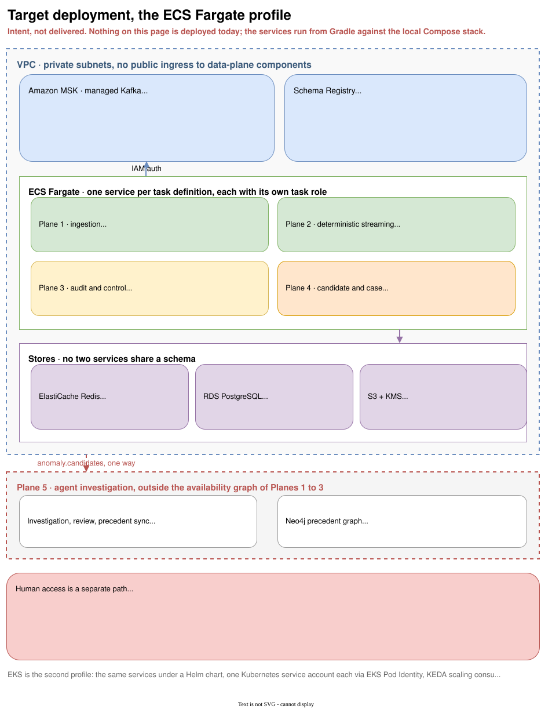

# Target architecture

!!! note "This page describes intent, not delivered code"

    Like [What this platform is for](purpose.md), this page explains the system the code is being
    built towards, and the reasoning behind its shape. Six modules exist today. What actually runs is
    in the [delivery state table](index.md#delivery-state-at-a-glance), and the gap is itemised in
    [Specified, not built](not-built.md).

Five principles drive the design. Every component is independently scalable. Observability is built
in from the first commit rather than added later. Failure is expected and recoverable, through
retries, dead-letter topics, replay controls and reconciliation. Identity is a platform primitive
rather than a perimeter. Sensitive actions are governed and produce durable evidence.

## Why five planes

The platform is split into five planes because they have genuinely different reliability, latency,
identity and cost characteristics. Splitting on those axes is what allows each to be operated,
scaled, and reasoned about on its own terms.

| Plane | Latency character | Failure tolerance | Cost driver |
| --- | --- | --- | --- |
| 1. Ingestion and migration | Throughput-bound | Backpressure, not loss | Broker throughput |
| 2. Deterministic streaming | Sub-200ms budget | Must not stall | Consumer instances |
| 3. Audit and control | Bounded lag, minutes | Must not lose | Storage and retention |
| 4. Candidate and case | Seconds | Degrades gracefully | Modest |
| 5. Agent investigation | Seconds to minutes | Fully optional | Tokens, per invocation |

The five-plane picture, with what is built marked, is on [Five planes](planes.md).

## The invariant, and what it buys

Plane 5 is asynchronous and optional. A provider outage, throttling, graph unavailability or budget
exhaustion must never block Planes 1 to 3 or add an availability dependency to them.

The consequence worth internalising: **the same event can carry two different service-level
objectives.** A trade gets a sub-200ms deterministic risk decision, and, if deterministic screening
promotes it, a seconds-to-minutes investigation with an entirely separate objective. Conflating the
two is how a system ends up with an LLM in a risk hot path.

Three design rules follow, and all three are already visible in the repository:

**Deterministic screening comes first.** A bounded subset reaches `anomaly.candidates`. An LLM is
never called per event (ADR-021). The agent plane consumes `anomaly.candidates` and never
`trades.enriched`.

**The dependency edge is one way and structural.** `services/control` writes `anomaly.candidates` and
must not depend on anything that reads it. `./gradlew checkPlaneIsolation` turns that from prose into
a build failure. See [Modules and the isolation rule](modules.md).

**The agent proposes, it never acts.** Read-only tools plus `flag-for-review`, which creates a
proposal only. The model holds no credential for ledger mutation, rule approval, DLQ replay, IAM
administration, audit retention changes or remediation. Safety is an authorization property enforced
outside the model, never a prompt asking it to behave (ADR-023).

## Plane by plane

**Plane 1, ingestion and migration.** Four synthetic producers plus a real Debezium PostgreSQL
connector reading a mock legacy source into `legacy.trades.cdc`, normalised into the canonical
`TradeEvent`. CDC is captured with the real connector rather than simulated in application code
(ADR-020), because the interesting problems, snapshot and stream coexistence, connector restart,
deduplication and cutover, only exist when the connector is real.

**Plane 2, deterministic streaming.** A projector maintains Redis market state from
`market-data.ticks`; enrichment joins it to trades; risk evaluates governed rule versions; a position
and exposure read model is kept idempotent by `tradeId` and is rebuildable from history (ADR-017).
One constraint is fixed in advance: on a cache miss, enrichment must not fall back to a synchronous
call to the simulator (ADR-027). A read path that reaches back into a producer converts a cache miss
into an availability dependency.

**Plane 3, audit and control.** Every evidence topic archived to S3 in Parquet, partitioned by date
and event type for Athena. Records are immutable, with Object Lock and a customer-managed KMS key.
Manifests are signed so tampering is detectable, and a reconciliation control proves the archive
covers the stream. The audit role may `PutObject` and `Sign`, and may not delete, overwrite, bypass
retention, administer the bucket policy or verify (ADR-012). Verification is somebody else's job by
design.

**Plane 4, candidate and case.** Deterministic anomaly screening, alert case lifecycle, and
maker-checker rule governance. A `RiskMaker` may not approve a change they proposed, and that is
enforced in policy rather than in the UI, with a passing negative test as the completion condition
(ADR-016).

**Plane 5, agent investigation.** A bounded LLM agent works a candidate through typed read-only
tools, retrieves similar prior cases from a precedent graph, and prepares an evidence-backed case for
a human. Hard limits on wall-clock duration, iterations, tool calls and per-invocation budget;
exhaustion fails safe to `ESCALATE`, never to `NO_FLAG`. Structured decision traces are persisted:
model, prompt and tool versions, tool calls, precedent ids, verdict, latency, tokens, cost. Raw
chain-of-thought is not (ADR-025).

## Where state lives, and why

Each store is chosen for one property, and no two services share a schema.

| Store | Holds | Chosen for |
| --- | --- | --- |
| Kafka | The event log, and every inter-service dependency | Replay, ordering per key, consumer independence |
| Redis | Market state projected from ticks | Sub-millisecond lookup on the enrichment hot path (ADR-007) |
| PostgreSQL | Risk state, positions, cases, decisions, feedback | ACID, and it stays authoritative for anything reviewed (ADR-008) |
| S3 + Parquet | The evidence archive | Cost-efficient immutable retention, queryable via Athena (ADR-005) |
| Neo4j | Precedent graph | Traversal over similar cases; derived and rebuildable, never authoritative (ADR-022) |

The last row carries a rule that is easy to lose: the graph is a projection. PostgreSQL remains the
source of truth for cases, decisions and feedback, and the agent must degrade when the graph is
unavailable rather than failing.

## Identity architecture

Three identity populations, kept distinct on purpose.

**Human.** `PlatformAdmin`, `RiskMaker`, `RiskChecker`, `Operator`, `ComplianceAuditor`,
`SecurityAuditor`, authenticating through an OIDC provider. Keycloak locally, an enterprise provider
in cloud, without changing application authorization semantics (ADR-011).

**Workload.** Every service gets its own identity: an ECS task role, or a Kubernetes service account
mapped to EKS Pod Identity. No application workload uses a long-lived AWS access key (ADR-010,
ADR-013). Kafka authorization in cloud is MSK IAM scoped per topic, per consumer group, per identity
(ADR-009).

**Agent.** The agent is a workload with its own identity and a deliberately impoverished one. Its
capability boundary is the tool gateway, not the prompt.

Authorization is layered rather than merged. A human reaching a privileged operation passes through
the admin control plane as the policy enforcement point and an externalised OPA policy decision
point, which sees role, action, resource and reason. A workload reaching AWS passes through IAM. In
the advanced EKS profile, workload-to-workload traffic additionally carries a SPIFFE identity for
mTLS, complementing rather than replacing IAM.

Every privileged action records actor, role, action, target, reason, request id, policy decision,
timestamp and outcome, and emits a `SecurityEvent` for both allow and deny.

The delivered half of this, the per-service Kafka policy and its negative tests, is on
[Workload authorization](authorization.md).

## Deployment topology

{ .diagram }
Click to zoom. Source: `guide/docs/diagrams/target-deployment.drawio`.
{: .diagram-hint }

ECS Fargate is the primary cloud path (ADR-004): serverless containers, no node management, one task
definition and one task role per service. Scaling is Application Auto Scaling driven by
CloudWatch lag metrics (ADR-015).

EKS is the second profile and an ephemeral one: the same services under a Helm chart, KEDA scaling
consumers from consumer lag (ADR-003), NetworkPolicies restricting east-west traffic, and SPIFFE and
SPIRE in the advanced-security variant (ADR-014). It exists to validate the Kubernetes path, and
comes with a cost estimate and a tagged teardown plan rather than an indefinite lifetime.

Data-plane components run in private subnets. MSK, PostgreSQL, Redis, the registry, the telemetry
backends and the admin services take no public ingress.

## Technology choices

| Layer | Technology | Reason |
| --- | --- | --- |
| Language | Java 25 | LTS, virtual threads, scoped values |
| Framework | Spring Boot 4.1 | Spring Kafka, Actuator |
| Build | Gradle 9.5 | Multi-module, toolchain pinning, dependency rules |
| Messaging | Apache Kafka, MSK in cloud | Managed brokers, no operational overhead (ADR-001) |
| Serialisation | Avro with Schema Registry | Enforceable compatibility (ADR-002) |
| Change capture | Debezium PostgreSQL connector | Real CDC, not a simulation (ADR-020) |
| Tracing, metrics, logs | OpenTelemetry, Prometheus, Loki, Grafana | Vendor-neutral, dashboards as code |
| Policy | OPA and Rego | Externalised privileged authorization |
| Keys | AWS KMS | Encryption, and audit-manifest signing |

## How the target and the code relate today

The spine exists: contracts, the durability and offset profiles, four producers, one consumer, the
authorization model, both build gates, the local stack. Everything above the spine is specified and
unwritten.

The order is deliberate. Deterministic streaming and security enforcement land before any agent work,
on the argument that a control path you cannot yet authorize is not a control path, and an agent
plane built before the deterministic one has nothing trustworthy to be optional to.
