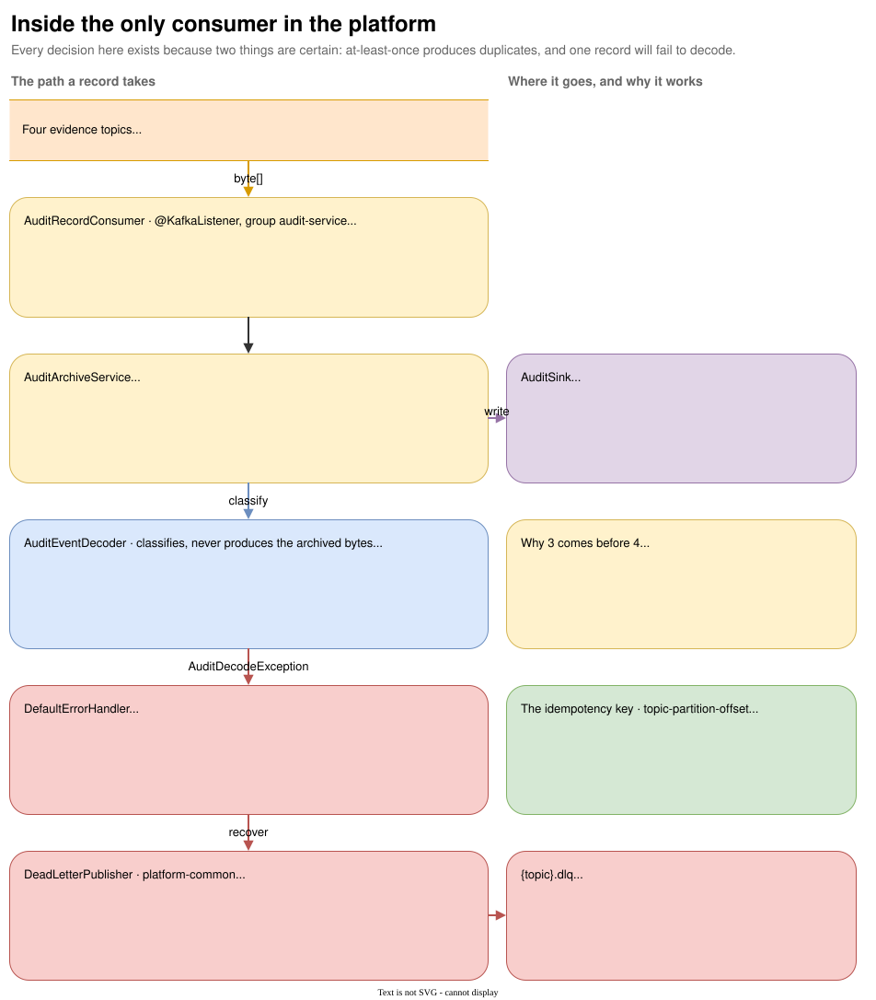

# The audit consumer

{ .diagram }
Click to zoom. Source: `guide/docs/diagrams/audit-consumer.drawio`.
{: .diagram-hint }

`audit-service` is the platform's first and, today, only consumer. Every design decision on this path
exists because two things are certain: at-least-once delivery produces duplicates, and one record will
eventually fail to decode.

[Follow one trade](spine.md) walks the happy path end to end. This page covers the parts that page
skims.

## What it subscribes to

```yaml
fes:
  audit-service:
    topics: trades.raw,market-data.ticks,corporate-actions,reference-data.instruments
    consumer-instance: ${HOSTNAME:audit-service-local}
    recent-record-window: 100000
```

FR-05.1 lists every evidence topic. This is the subset with a producer today. The enrichment, risk,
control, security and agent topics are unsubscribed because nothing writes them yet, and each joins
the list as its producer ships.

The consumer group is `audit-service`. Group name equals service name, no suffix, because the name is
also what the `GROUP` grant in the service's Kafka policy scopes and what a KEDA query would use.

## Classification without a compile-time dependency

`AuditEventDecoder` answers one question: what event type is this payload?

```java
deserializer.configure(Map.of(
        AbstractKafkaSchemaSerDeConfig.SCHEMA_REGISTRY_URL_CONFIG, schemaRegistryUrl,
        KafkaAvroDeserializerConfig.SPECIFIC_AVRO_READER_CONFIG, false), false);
```

Generic, not specific. A specific reader would force this module to depend on every schema in the
platform and to be redeployed each time one is added. The generic reader resolves the writer schema
from the registry and the decoder takes the schema name, which is what an S3 key's `event_type=`
partition needs when the durable sink lands.

Two edge cases are handled explicitly. A null value returns `"Tombstone"`, which is legitimate on the
compacted `reference-data.instruments`. Anything that decodes to something without a schema raises
`AuditDecodeException` rather than being archived as evidence nothing can read.

Decoding never produces the archived bytes. The class exists to classify.

## Deduplication, and what it does not claim

The key is `topic + "-" + partition + "-" + offset`, the canonical event idempotency key for the
audit path. Broker coordinates make a duplicate recognisable
without the archive understanding any event's payload.

The window is bounded:

```java
Map<String, Boolean> lru = new LinkedHashMap<>(window, 0.75f, true) {
    @Override
    protected boolean removeEldestEntry(Map.Entry<String, Boolean> eldest) {
        return size() > window;
    }
};
return Collections.newSetFromMap(Collections.synchronizedMap(lru));
```

Access-ordered, capped at 100,000, synchronized.

Three tests pin the semantics: `should_write_once_when_the_same_record_is_delivered_twice`,
`should_treat_the_same_offset_on_a_different_partition_as_a_different_record`, and
`should_archive_again_once_a_record_falls_out_of_the_bounded_window`. The third one is a test that
asserts the limitation rather than hiding it.

This covers the duplicate at-least-once actually produces: redelivery of uncommitted offsets inside a
running consumer. It does not survive a restart. Restart-safe deduplication belongs to the durable
sink, whose object key carries the offset range.

## The write-then-mark ordering

```java
sink.write(archived);
recentlyArchived.add(archived.idempotencyKey());
```

Marking first would make a failed write look like a completed one to the retry that follows, and the
record would be dropped rather than quarantined. That is a silent hole in the evidence trail with
nothing failing anywhere, which is the worst failure mode an archive can have.

## Retry and quarantine

`AuditKafkaConfiguration` decides which failures retry. What a retry costs is not its to choose:
it calls `PoisonRecordPolicy.poisonBackOff()` in `platform-common`, which every consumer that
quarantines per record shares.

```java
private static final long MAX_RETRIES = 2;          // three attempts in total
private static final long INITIAL_BACKOFF_MS = 100;
private static final long MAX_BACKOFF_MS = 5_000;
private static final long MAX_ELAPSED_MS = 5_000;
```

Three attempts, because the failures worth retrying here are transient sink and registry errors, and a
longer sequence holds up the partition without changing the outcome. The bound is shared rather than
per service because it decides how long one bad record holds its partition, and a service that quietly
widened it would turn a bounded quarantine into unbounded lag on a topic nobody is watching.

```java
errorHandler.addNotRetryableExceptions(AuditDecodeException.class);
errorHandler.setRetryListeners(failureTracker);
errorHandler.setAckAfterHandle(true);
```

A decode failure is not retried at all: the bytes do not improve.

`setRetryListeners(failureTracker)` is what lets the quarantined event carry a real `retryCount` and
`firstFailureAt` instead of two values invented at quarantine time. `FailureTracker` implements Spring
Kafka's `RetryListener`, keyed on the same topic-partition-offset triple, and the entry lives exactly
as long as the retry sequence. It is per-process state, so a restart mid-retry restarts the count, and
that is visible in the quarantined event rather than hidden: `retryCount` is the attempts this process
made.

`setAckAfterHandle(true)` commits the recovered record's offset, so one poison payload does not block
the partition behind it.

## The dead-letter publisher

`DeadLetterPublisher` lives in `platform-common`, because quarantine is a platform convention rather
than an audit-service feature.

The topic is derived: `record.topic() + DLQ_SUFFIX`, where the suffix is the lowercase `.dlq`. Never
configured per service, so no service can ship a name a replay tool will not look at.

The record keeps its original key. A quarantined record and the records that follow it for the same
key stay on one partition, and a replay preserves their order.

The event carries the delivered bytes rather than a re-encoding, for the same reason the archive does:
the payload may have failed to decode in the first place. Alongside them it carries the whole cause
chain, the root cause's class and message, a 500-character stack trace summary, the attempt count,
both failure timestamps, and the consumer group and instance. The root cause is named separately
because the container reports its own wrapper, and an operator triaging the DLQ needs the cause.

The recoverer joins on the send:

```java
publisher.publish(failed, failed.value(), exception).join();
```

If the quarantine send fails, the exception propagates and the container stops, rather than the offset
advancing past a record that was archived nowhere.

## No event-type-wide breaker

Quarantine is per record (ADR-027). A breaker that opens on a malformed payload stops archiving every
healthy record behind it, which is the exact failure quarantine exists to avoid. Circuit breakers in
this platform protect calls to failing dependencies such as Redis or PostgreSQL, and nothing else.

## The gap, stated plainly

`LoggingAuditSink` logs the record and discards it.

The durable sink is Phase 3: S3 Parquet objects, a sidecar manifest, a KMS signature, and Object Lock
retention, with the audit role able to `s3:PutObject` and `kms:Sign` but not to delete, overwrite,
bypass retention, administer the bucket policy or verify (ADR-012).

Until then, no FR-05 or FR-16 evidence claim rests on this module. What is real today is the consumer,
the classification, the idempotency key, the ordering discipline and the quarantine path. What is not
real is the evidence.
