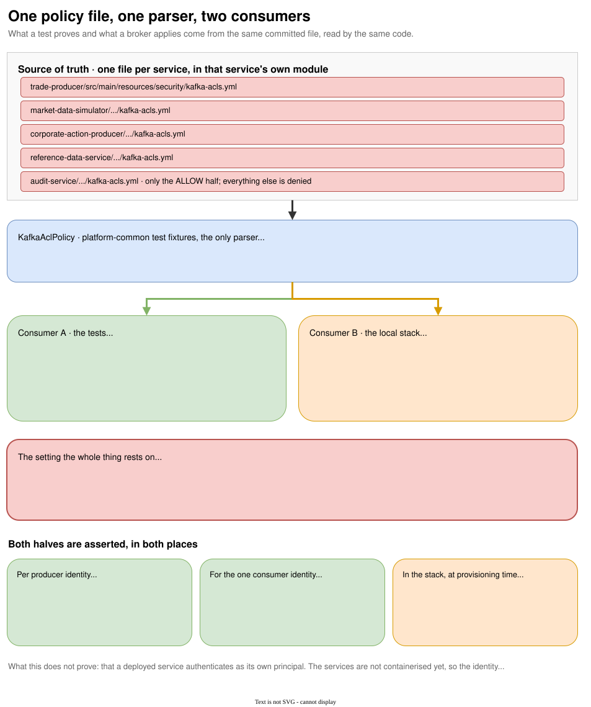

# Workload authorization

{ .diagram }
Click to zoom. Source: `guide/docs/diagrams/acl-single-source.drawio`.
{: .diagram-hint }

This is the part of the platform with the most finished thinking in it, and it is worth reading even
if you never touch Kafka authorization. The shape generalises: put the policy in the repository, read
it with one piece of code, and make both the test and the runtime consume that code.

## The problem it solves

A security control that a test invents is a control the test is asserting against itself. Write the
grants inline in a test and you have proved that the broker enforces the grants the test just created,
which is a fact about Kafka rather than about your system.

Worse, the grants a test asserts and the grants an environment applies then live in two places, and
they drift.

## The design

Each service commits one file, in its own module:

```text
services/ingestion/trade-producer/src/main/resources/security/kafka-acls.yml
```

```yaml
principal: trade-producer

allowed:
  - resourceType: TOPIC
    name: trades.raw
    operations: [WRITE]
```

That is the entire permission set for the trade producer. Everything absent is denied, because the
broker runs `allow.everyone.if.no.acl.found=false`. `DESCRIBE` is implied by `READ` and `WRITE` and is
not listed.

`KafkaAclPolicy` in `platform-common` test fixtures parses it, and it is the only parser:

```java
public record KafkaAclPolicy(String principal, List<Grant> allowed) {
    public record Grant(ResourceType resourceType, String name, List<AclOperation> operations) { }

    public static KafkaAclPolicy load();                  // from the calling module's classpath
    public static KafkaAclPolicy loadFile(Path path);     // by path, for the local stack
    public List<String> topics();                         // every topic the policy names
}
```

Two consumers read it.

**The tests.** `SecureKafkaStack.apply(policy)` creates the topics the policy names and the ALLOW
bindings, on a real broker.

**The local stack.** `./gradlew renderKafkaAcls` runs `KafkaAclScriptRenderer`, which writes one
`kafka-acls.sh` argument line per grant into `build/kafka-acls.args`, and `scripts/local-stack.sh`
feeds each line to the broker. Thirteen ACLs on the current policy set.

Because both paths go through `KafkaAclPolicy`, a grant cannot be proven in a test and missing from
the stack, or the reverse.

The renderer emits arguments rather than whole commands, because the bootstrap address and the
command-config belong to the script that knows which profile is running.

## The setting the whole thing rests on

```yaml
KAFKA_AUTHORIZER_CLASS_NAME: org.apache.kafka.metadata.authorizer.StandardAuthorizer
KAFKA_ALLOW_EVERYONE_IF_NO_ACL_FOUND: "false"
```

With that flag true, an identity holding no ACL would be allowed everything and every denial
assertion in the suite would pass vacuously.

## The discriminator test

Every DENY assertion rests on one assumption: that an authenticated identity with no grant is
*refused*, and that the refusal is distinguishable from a broker that is unreachable, misconfigured or
slow. If an absent grant produced a timeout instead, all ten denial assertions in the suite would pass
while proving nothing.

`SecureKafkaStackTest` is the one test that checks the assumption:

```java
assertThatThrownBy(() -> producer.send(new ProducerRecord<>(TOPIC, "K", new byte[]{1})).get())
        .isInstanceOf(ExecutionException.class)
        .as("a timeout here would mean the denial tests cannot tell denied from broken")
        .hasCauseInstanceOf(TopicAuthorizationException.class);
```

Write one of these for any deny-by-default system you build. Without it, the rest of the suite is
decoration.

## The producer contract: one ALLOW, two DENY

`KafkaProducerAuthorizationContract` is an abstract class each write-only identity extends with three
values:

```java
class TradeProducerAuthorizationTest extends KafkaProducerAuthorizationContract {
    protected String principal()    { return "trade-producer"; }
    protected String ownTopic()     { return "trades.raw"; }
    protected String foreignTopic() { return "trades.enriched"; }
}
```

The setup asserts that the principal in the committed file matches the principal the test claims to be
testing, then applies the policy. The three tests are:

**ALLOW** write the topic this identity owns.

**DENY** read the topic this identity writes. A write-only identity that can read back its own topic
is not write-only.

**DENY** write another service's topic.

Two details in the contract are the kind of thing that gets a test wrong quietly.

The read denial uses `assign` rather than `subscribe`. Subscribing needs a consumer group, and an
identity with no group grant would be refused for the group before the broker considered the topic,
which proves something other than what the row claims. `SecureKafkaStack.consumerConfig` accepts a
null group precisely so `group.id` can be left unset.

`trade-producer`'s foreign topic is `trades.enriched` rather than a sibling producer's topic. That
makes the denial the one that matters: a producer that could write `trades.enriched` could inject
trades that skipped enrichment entirely.

## A second consumer, scoped narrower still

`market-data-cache-projector` grants `READ` on `market-data.ticks`, `WRITE` on
`market-data.ticks.dlq`, and `READ` on the `GROUP` named after itself. Four assertions in
`MarketDataCacheProjectorAuthorizationTest`, one allowed and three denied:

**ALLOW** read `market-data.ticks` through its own consumer group.

**DENY** read `trades.raw`. The projector has no business in the trade stream, and a grant it does not
need is a grant an attacker inherits.

**DENY** join another workload's consumer group.

**DENY** write `market-data.ticks`, the topic it projects. A projector that can write the tick stream
can manufacture the prices it is supposed to be observing.

Its Redis access is scoped the same way and is covered in
[the market cache projector](projector.md).

## A consumer with two inputs, and the denial that matters most

`trade-enrichment-service` reads two topics rather than one: `trades.raw` and
`reference-data.instruments`, the compacted instrument master. Only `trades.raw` carries a `GROUP`
grant. The instrument master is folded by a consumer that `assign()`s every partition and joins no
group at all, so a `GROUP` grant for it would be both unused and a permission this identity has no
reason to hold (ADR-034). It also writes `trades.enriched` and, for quarantine, `trades.raw.dlq`.

`TradeEnrichmentServiceAuthorizationTest` proves three allowed actions and three denied ones:

**ALLOW** read `trades.raw` through its own consumer group, read the instrument master with no group
at all, and write `trades.enriched`.

**DENY** read `market-data.ticks`. This is the assertion that matters most in the whole file. Market
state reaches this service through Redis, projected by `market-data-cache-projector` (ADR-027). A
grant on the tick topic would be a second route to the same data and a way to bypass the projection
that ADR-027 exists to enforce, regardless of what the Redis ACL restricts.

**DENY** write `trades.raw`, the topic it consumes. A service that can write its own input can replay
its own backlog.

**DENY** join `market-data-cache-projector`'s consumer group.

`TradeEnrichmentServiceIdentityStackTest` proves this identity's ungranted run is denied and its
granted run actually enriches a trade, but nothing pins the ungranted run to one exception class.
`InstrumentCacheLoader`'s readiness gate calls `partitionsFor` on `reference-data.instruments` before
the trade listener ever attempts to join its group, so the two Kafka calls a fully ungranted identity
makes on startup, a topic describe and a group join, are independent, and either could be the one
the broker denies first. Both raise a subclass of `org.apache.kafka.common.errors.AuthorizationException`,
so the test matches that shared substring rather than committing to whichever one happens to fire.

Its Redis grant holds `+eval`, `+evalsha` and `+hgetall`, and nothing that writes, in
`deploy/compose/redis/users.acl.template`. `EnrichmentRedisAclIntegrationTest` renders that template
with a test password, the same substitution `scripts/generate-dev-security-material.sh` performs, and
proves two denials that have to use different Redis features to mean anything.

The first sends `HSET` inside the same `EVAL` the read script uses. Redis wraps a denial raised inside
a script differently from a denial on a direct command: the message is `ERR ACL failure in script:
User trade-enrichment-service has no permissions to run the 'hset' command`, not the bare `NOPERM` a
direct command gets. It still names the ACL rather than failing with `unknown command`, which is what
tells the two apart: the second would mean the probe never reached the authorizer at all.

The second sends `HGETALL`, a command this identity does hold, against a key outside `market:*`. That
one does carry `NOPERM No permissions to access a key` verbatim, because Redis reaches the key-space
check on a command it already recognises. The projector's own key-space probe made this exact
distinction first, after an earlier attempt used a never-granted command for both checks and ended up
proving command denial twice rather than proving the key scope at all.

`deploy/compose/docker-compose.strict-security.yml` gains no second healthcheck for this identity. The
projector's healthcheck authenticates as the projector user, so it says nothing about whether
`FES_REDIS_ENRICHMENT_SECRET` renders into the ACL file correctly; only `EnrichmentRedisAclIntegrationTest`
proves that, by rendering the committed template itself rather than a liveness probe against a
container that is already known to be reachable.

## The consumer contract is the inverse

`audit-service` does not extend the producer contract, because its shape is reversed. Its policy grants
`READ` on four evidence topics, `WRITE` on the four matching `.dlq` topics, and `READ` on the `GROUP`
named `audit-service`.

Its three tests are:

**ALLOW** read an archived topic through its own consumer group.

**DENY** write a financial topic. An audit identity that can write `trades.raw` can manufacture the
evidence it is supposed to be archiving.

**DENY** join a consumer group other than its own. This is the denial no producer test can provide,
because no producer has a group, and it matters: an identity that can join another workload's group
can advance that workload's offsets and make its records disappear without touching a single topic
ACL.

## Enforcement is verified at provisioning time too

Bringing up the strict-security stack asserts both halves of least privilege before it prints a
success banner:

```bash
verify_least_privilege() {
  # trade-producer -> trades.raw          must succeed
  # trade-producer -> market-data.ticks   must be refused
}
```

A denial on its own does not distinguish an enforced policy from a client that cannot connect at all,
which would deny everything and prove nothing. Both probes send a real record: an empty stdin makes
the console producer exit successfully without ever contacting the topic, which looks like a pass.

## What is proven, and what is not

**Proven.** That each committed policy is enforceable on a real broker that denies by default, and
that each identity can do only what its file allows.

**Also proven, since the services were containerised.** That a running service authenticates as its
own principal rather than as an administrator. Each module now carries a `ServiceIdentityStackTest`
that runs the service's own image against the secure broker twice, denied while ungranted and working
once `User:<service>` alone is granted. [Service identity](identity.md) covers how, and why a test
that only asserted a successful publish would have proved nothing.

**Not proven.** Anything about MSK IAM, which is the cloud authorization path and is not exercised
here. The strict-security compose stack also still does not run the services themselves; the binding
is proven in CI rather than demonstrated live.

Cloud deployments authorise with MSK IAM scoped per topic, per consumer group, per identity (ADR-009).
ACLs exist for the local strict-security profile. A test here proves the policy, not the deployment.

## Adding a service

A security feature is not done until the repository shows both an allowed path and a denied path. For
a new service that means:

1. A row in the identity trust matrix.
2. A committed `src/main/resources/security/kafka-acls.yml`.
3. The principal added to `SecureKafkaStack.PRINCIPALS`, so the broker has its credential.
4. At least one ALLOW and two DENY tests, driven by the committed file.

Plus, since [Service identity](identity.md) landed, a `ServiceIdentityStackTest` proving the running
service presents that principal.

One constraint on step 4: `SecureKafkaStack` grants are additive and nothing revokes them, and the
container is static. Every service module now has two ACL-applying classes, its authorization test and
its identity test, so `integrationTest` sets `forkEvery = 1` and each gets a clean broker. That
setting is load-bearing rather than a tuning choice: put two such classes in one JVM and the second
inherits the first's grants, which turns a denial assertion into a pass without failing anything.
