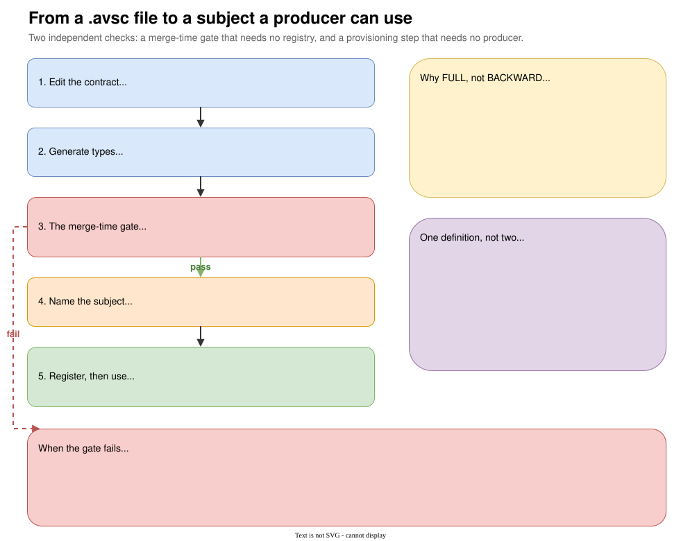

# Event contracts

{ .diagram }
Click to zoom. Source: `guide/docs/diagrams/schema-pipeline.drawio`.
{: .diagram-hint }

Sixteen Avro schemas in `contracts/src/main/avro/`, namespace `dev.engnotes.fes.events`, generating 31
Java types at build time. Avro rather than JSON, because a financial payload needs a schema the broker
side can enforce and a compatibility model a build can check (ADR-002). JSON is permitted only for
control-plane HTTP APIs, structured logs and audit manifest metadata.

## The sixteen

| Schema | Topic | Built and in use |
| --- | --- | --- |
| `TradeEvent` | `trades.raw` | yes |
| `MarketDataTickEvent` | `market-data.ticks` | yes |
| `CorporateActionEvent` | `corporate-actions` | yes |
| `InstrumentReferenceEvent` | `reference-data.instruments` | yes |
| `DeadLetterEvent` | every `{topic}.dlq` | yes |
| `EnrichedTradeEvent` | `trades.enriched` | schema only |
| `PositionSnapshotEvent` | `positions.snapshots` | schema only |
| `RiskAlertEvent` | `notifications.alerts` | schema only |
| `RiskRuleLifecycleEvent` | `risk-rules.events` | schema only |
| `AlertCaseEvent` | `alert-cases.events` | schema only |
| `ReconciliationEvent` | `controls.reconciliation` | schema only |
| `ReconciliationObservationEvent` | `reconciliation.observations` | schema only |
| `SecurityEvent` | `security.events` | schema only |
| `AnomalyCandidateEvent` | `anomaly.candidates` | schema only |
| `AgentDecisionEvent` | `agent.decisions` | schema only |
| `HumanReviewDecisionEvent` | `review.decisions` | schema only |

Eleven of the sixteen are contracts for services that do not exist. They are still under the
compatibility gate, so a change to `RiskAlertEvent` today is checked with the same strictness as a
change to `TradeEvent`, and the code generated from them compiles.

## Generation

`contracts/build.gradle` configures the Avro plugin:

```groovy
avro {
    stringType = 'String'
    fieldVisibility = 'PRIVATE'
    enableDecimalLogicalType = true
    outputCharacterEncoding = 'UTF-8'
}
```

`stringType = 'String'` matters when you read the producer code. Without it Avro generates
`CharSequence` accessors, which is why `TradeEventPublisher` calls `trade.getTicker().toString()`
rather than using the value directly in one place and not another. Generated event classes are never
hand-written, and never converted to records: the plugin owns them.

## The compatibility gate

`SchemaCompatibilityTest` in `contracts/src/test/java` is the FR-02.2 gate. Every schema in
`src/main/avro` must be mutually readable with the accepted baseline in
`src/test/resources/schema-baseline`.

```java
private static final SchemaValidator FULLY_COMPATIBLE_WITH_BASELINE =
        new SchemaValidatorBuilder().mutualReadStrategy().validateLatest();
```

Mutual read is Confluent's FULL: new readers must read old data, and old readers must read new data.

### Why FULL and not BACKWARD

BACKWARD alone permits field removal, because a new reader simply ignores the dropped field. The
architecture's stated evolution policy is "new optional fields with defaults, no field removal, no
type changes", and only FULL enforces that as written.

FULL is also what a rolling upgrade needs (FR-02.3). Two schema versions are live at once during a
rollout, and an old consumer must still read a new producer's output.

### Why offline

The check runs against a committed baseline directory, not against a registry (ADR-029). The gate is
therefore deterministic: it produces the same verdict on a laptop, in CI, and six months from now, and
it cannot be changed by whatever someone registered in a shared registry yesterday.

### What it allows and refuses

The failure message is the specification:

```text
Allowed: add an optional field with a default, widen a union.
Not allowed: remove a field, rename a field, change a type, add a mandatory
field without a default, make an optional field mandatory, remove an enum symbol.
```

Two additional assertions sit alongside the per-schema check. One fails if a schema present in the
baseline has disappeared from `src/main/avro`, because removing a schema breaks every consumer still
reading that topic. The other fails if any schema leaves the `dev.engnotes.fes.events` namespace.

### Accepting a deliberate break

```bash
./gradlew updateSchemaBaseline
```

The task copies `src/main/avro` over `src/test/resources/schema-baseline` and says so:

```console
Schema baseline updated. Commit the diff and justify any breaking change.
```

The point is that the break becomes a reviewable diff in a pull request rather than a silent pass.

### One implementation detail worth knowing

`parseAll` uses a single shared `Schema.Parser` and retries files until the set stops shrinking. This
is how `EnrichedTradeEvent` resolves its reference to `TradeEvent` regardless of filename ordering,
without the test hard-coding a parse order.

## Registration is provisioning, not a side effect

Producers run `auto.register.schemas: false`. A deploy must not be able to introduce a schema version
that routed around the gate above.

That makes registration a separate step, performed by `scripts/local-stack.sh` from
`deploy/compose/subjects.tsv`. It POSTs each schema to `/subjects/{topic}-value/versions` with its
references resolved to a concrete subject and version. The registry itself runs
`SCHEMA_REGISTRY_SCHEMA_COMPATIBILITY_LEVEL: full`, matching the merge-time gate: a registry that
accepted what the build rejects would make the gate advisory.

A topic whose subject was never registered fails at the first record, not at startup. That is exactly
how the audit service's dead-letter path stayed broken until the four `{topic}.dlq` subjects were
written into `subjects.tsv`.

## What is not checked yet

There is no runtime validation of subject naming or of the registry's per-subject compatibility
configuration. The merge-time gate covers schema algebra only. `docs/task-status.md` lists this as an
open gap.
