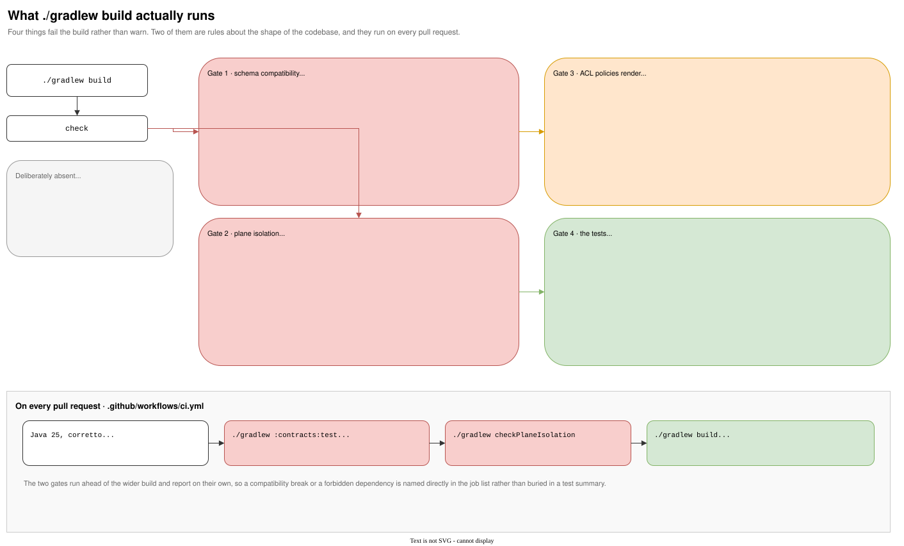

# Build gates and CI

{ .diagram }
Click to zoom. Source: `guide/docs/diagrams/build-gates.drawio`.
{: .diagram-hint }

Six things fail `./gradlew build` rather than warn. Two of them are rules about the shape of the
codebase rather than about its behaviour, and those two run as their own CI steps so a violation is
named in the job list rather than buried in a test summary.

## Gate 1: schema compatibility

```bash
./gradlew :contracts:test
```

Every `.avsc` must stay mutually readable with the committed baseline. FULL rather than BACKWARD,
offline rather than against a registry. Covered in full in [Event contracts](contracts.md).

## Gate 2: plane isolation

```bash
./gradlew checkPlaneIsolation
```

No module under `services/ingestion`, `services/streaming` or `services/audit` may depend on a
`:services:agent` project or on an agent-plane library. Covered in
[Modules and the isolation rule](modules.md).

## Gate 3: formatting

```bash
./gradlew spotlessCheck        # ./gradlew spotlessApply to fix
```

Spotless, applied to every module, and deliberately narrow: import order, unused imports, no wildcard
imports, trailing whitespace, a final newline, and annotation placement. No reflow.

That narrowness is the point. The source tree carries hand-wrapped comment blocks that explain why a
setting is what it is, and an opinionated formatter would rewrite all of them to make a point about
line breaks. Running the full ruleset once touched 39 files; the ruleset that shipped touched 4, and
three of those were misordered import blocks.

```groovy
importOrder('java|javax', '', '\\#')
removeUnusedImports('cleanthat-javaparser-unnecessaryimport')
forbidWildcardImports()
```

The generated Avro sources are excluded by targeting `src/**/*.java` rather than the source sets,
which in `contracts` include the code-generation output directory.

`-Xlint:all` and `-parameters` are on every `JavaCompile` task. Warnings are reported, not fatal. The
raw count is 76: 50 of those come from the generated Avro sources, which declare no `serialVersionUID`
and open each file with the schema comment ahead of the package declaration. Those two categories are
switched off in `contracts/build.gradle` alone, where there is no source to fix them in. The remaining
26 are unchecked-generic warnings from mocking `KafkaTemplate` in test code, and a `-Werror` gate is a
decision to take against that number rather than ahead of it.

## Gate 4: the ACL policies render

```bash
./gradlew renderKafkaAcls
```

Reads every `services/*/*/src/main/resources/security/kafka-acls.yml` with the same parser the tests
use and writes `build/kafka-acls.args`.

This runs on every build, which is the point. A malformed or unrenderable policy fails here rather
than days later when someone brings up the strict-security stack, and the task fails outright if it
finds no policy file at all, because every service commits one.

```groovy
doFirst {
    if (policyFiles.isEmpty()) {
        throw new GradleException('No service kafka-acls.yml found. Every service commits one.')
    }
}
```

## Gate 5: the service images

```bash
./gradlew bootBuildImage
```

Every service module builds a container image, `fes/<module>:local`, from the Spring Boot plugin's
Paketo integration. No Dockerfile. Each module's `integrationTest` depends on its own image task, so
the identity proof in [Service identity](identity.md) cannot run against a stale or absent build.

A clean build with all five images forced to rebuild takes 38 seconds on the machine this was measured
on. Treat that as a floor rather than the CI figure: a CI runner pulls the Paketo builder and run
images fresh, and a development machine usually has them cached.

No property exists to skip the image build. A gate weakened on a predicted cost rather than an
observed one stops meaning anything.

## Gate 6: the tests

Three categories, all under each module's `check` task, run by two Gradle tasks.

```bash
./gradlew test                 # unit tests, no Docker needed
./gradlew integrationTest      # the Testcontainers-backed classes
./gradlew jacocoTestReport     # merged coverage from both
```

The split is by class name inside one `src/test` source set: `*IntegrationTest`, `*AuthorizationTest`
and `*StackTest` belong to `integrationTest`, everything else to `test`. The last two are on that list
because a name is not a reliable signal on its own: `*AuthorizationTest` extends the `SecureKafkaStack`
fixture and `SecureKafkaStackTest` tests that fixture directly, and both start a broker.

That matters more than tidiness. The split is only worth having if `test` genuinely needs no Docker,
which is checked by running it and confirming no container appeared: 124 unit tests, zero containers
created. 55 tests run under `integrationTest`.

`integrationTest` also sets `forkEvery = 1`, one test class per JVM. That is a correctness setting,
not a speed one. `SecureKafkaStack.apply` only ever creates ACLs and never revokes them, and every
service module now has two ACL-applying classes: its authorization test and its identity test. In one
JVM the second would inherit the first's grants and its denial assertion would silently pass. See
[Service identity](identity.md).

Each task runs its own JaCoCo agent and writes its own execution data, `build/jacoco/test.exec` and
`build/jacoco/integrationTest.exec`. `jacocoTestReport` merges both, so a line reached only by an
integration test still counts as covered. Generated Avro classes are excluded from the report, which
is why `contracts` reports no counters at all: every class in its main source set is generated.

No coverage threshold is configured. The report publishes the numbers first; a ratchet is a separate
decision to take against measured coverage rather than a guessed floor.

**Unit tests.** Pure logic, no Spring context. JUnit 5, Mockito, AssertJ.

**Integration tests.** `KafkaAvroStack`: a real broker on `apache/kafka-native:4.1.0` plus a real
Confluent Schema Registry on `confluentinc/cp-schema-registry:7.9.1`, on a shared Docker network,
started once per JVM.

The registry is not optional scaffolding. The platform serialises financial payloads with Avro against
a registry, and a producer test that skips it proves the object graph works while leaving the part
that actually breaks in production, schema resolution and subject compatibility, untested.

**Authorization tests.** `SecureKafkaStack`: a real broker on `apache/kafka:4.1.0` with SASL/PLAIN and
the `StandardAuthorizer`. Two broker images in one run is the cost of authenticated local tests. See
[Gotchas](gotchas.md#the-native-image-cannot-act-as-a-sasl-server) for why the images differ.

**Identity tests.** The same secure broker, plus a Schema Registry on its network, plus the service's
own container image. Each `ServiceIdentityStackTest` starts two containers of that image in sequence.
These are the slowest tests in the build and the only ones that need an image, which is why each
module's `integrationTest` depends on its own `bootBuildImage`.

A running Docker daemon is required.

## Required coverage by category

From `.claude/rules/testing.md`. These follow from the requirements and are not optional for a module
to be considered complete:

| Category | What it must show |
| --- | --- |
| Idempotency | The same event processed twice produces a single effect |
| Poison record | A malformed record is quarantined to `{topic}.dlq`, the offset advances, and the next record on the partition processes normally |
| Dependency failure | A Redis or PostgreSQL outage opens the circuit at the dependency boundary and does not quarantine otherwise valid records |
| Negative authorization | At least one ALLOW and two DENY per service, driven by the committed policy |
| Agent tool boundary | Unknown tool denied, undeclared argument rejected, injected instruction text ignored, failed required tool produces `ESCALATE` rather than `NO_FLAG` |
| Plane isolation | A build-level check |
| Rebuild | Read models and the precedent graph rebuild from event history and report a reconciliation result |

Four of those seven are exercised today. The other three belong to services that do not exist.

## The CI workflow

`.github/workflows/ci.yml`, on every pull request and on pushes to `main`:

```yaml
- name: Schema compatibility gate
  run: ./gradlew :contracts:test --tests '*SchemaCompatibilityTest'

- name: Plane isolation gate
  run: ./gradlew checkPlaneIsolation

- name: Build and test
  run: ./gradlew build
```

Java 25 from Corretto, `gradle/actions/setup-gradle` for caching, and test reports uploaded with
`if: always()` so a failing run still produces something to read. The upload path covers
`**/build/reports/tests`, both task directories, rather than only the unit-test one.

Formatting and coverage need no CI step of their own: `spotlessCheck`, `integrationTest` and
`jacocoTestReport` all hang off each module's `check` task, so `./gradlew build` runs them.

Running the two gates ahead of the wider build duplicates a little work and buys a clear signal: a
compatibility break or a forbidden dependency shows up as a named failed step.

## How versions are pinned

`gradle/libs.versions.toml` holds every version the build pins by hand: Avro, the Confluent serializer,
the Spring Boot and Avro plugins, Spotless and the JaCoCo agent. Everything the Spring Boot BOM manages
stays unversioned in the module files, so each half has exactly one source of truth.

The JaCoCo entry carries a reason. Gradle's bundled default trails the JDK, and the agent has to
understand the class file version the Java 25 toolchain emits.

`gradle.properties` turns on parallel execution, the build cache and the configuration cache. The last
of those is a correctness gate as much as a speed one: the plane-isolation and ACL-rendering tasks were
written to hold no reference to `Project` at execution time, and with the configuration cache on, that
property is enforced instead of merely intended.

## What is deliberately absent

No coverage floor, no `-Werror`, and no static-analysis tool beyond the compiler's own lint. Each of
those is a threshold, and a threshold guessed before the numbers exist fails the build for reasons
nobody chose.

## This guide's own build

`.github/workflows/guide.yml` builds the site with `mkdocs build --strict` on every pull request that
touches `guide/`, and publishes to GitHub Pages from `main`. Strict mode fails on a broken internal
link or a referenced-but-missing diagram, so a dead page fails CI rather than shipping.
