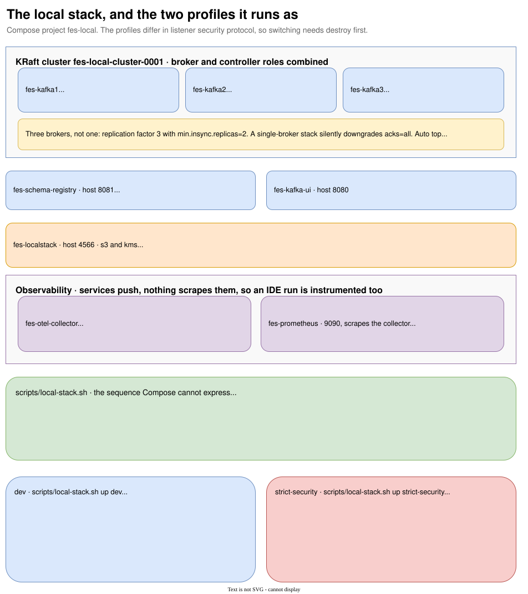

# The local stack

{ .diagram }
Click to zoom. Source: `guide/docs/diagrams/local-stack.drawio`.
{: .diagram-hint }

One script, two profiles, and a provisioning sequence Compose alone cannot express.

```bash
scripts/local-stack.sh up [dev|strict-security]   # bring it up and provision it
scripts/local-stack.sh down                       # stop it, keeping volumes
scripts/local-stack.sh destroy                    # stop it and delete the volumes
scripts/local-stack.sh status                     # what is running, and what is provisioned
```

Requires `docker`, `docker compose` v2 or later, `python3` and `curl`. Python builds the JSON for the
Schema Registry API, where hand-rolled quoting would be a bug waiting to happen.

## What comes up

| Container | Image | Host port |
| --- | --- | --- |
| `fes-kafka1` | `apache/kafka:4.1.0` | 29092 |
| `fes-kafka2` | `apache/kafka:4.1.0` | 29093 |
| `fes-kafka3` | `apache/kafka:4.1.0` | 29094 |
| `fes-schema-registry` | `confluentinc/cp-schema-registry:7.9.1` | 8081 |
| `fes-kafka-ui` | `provectuslabs/kafka-ui:v0.7.2` | 8080 |
| `fes-redis` | `redis:8.10.1-alpine` | 6379 |
| `fes-localstack` | `localstack/localstack:4.14.0` | 4566 |
| `fes-otel-collector` | `otel/opentelemetry-collector-contrib:0.158.0` | 4317 grpc, 4318 http |
| `fes-prometheus` | `prom/prometheus:v3.13.2` | 9090 |
| `fes-loki` | `grafana/loki:3.7.6` | 3100 |
| `fes-grafana` | `grafana/grafana:13.1.3` | 3000 |

Compose project name `fes-local`. Every image tag is pinned, so a run is reproducible and an upstream
release cannot break the stack overnight.

## Three brokers, and why

`acks=all` with `min.insync.replicas=2` is a claim until there are enough brokers to hold two in-sync
replicas.

```yaml
KAFKA_DEFAULT_REPLICATION_FACTOR: 3
KAFKA_MIN_INSYNC_REPLICAS: 2
KAFKA_OFFSETS_TOPIC_REPLICATION_FACTOR: 3
```

A single-broker stack silently downgrades the durability profile the producers are configured for.
KRaft, with the broker and controller roles combined, cluster id `fes-local-cluster-0001`.

`KAFKA_AUTO_CREATE_TOPICS_ENABLE: "false"`. Auto-creation would quietly produce single-partition
topics that do not match the inventory, and a 12-partition topic silently becoming a 1-partition topic
is the kind of difference that only shows up as a throughput ceiling much later.

## The provisioning sequence

`up` does this, in order:

1. On `strict-security`, generate TLS and credential material if it is not already there.
2. Refuse to start if a different profile is already provisioned. The profiles differ in listener
   security protocol, so switching needs `destroy` first.
3. `docker compose up -d`.
4. Wait for all three brokers, the registry and LocalStack to report healthy.
5. Create topics from `deploy/compose/topics.tsv`, with explicit partition counts and per-topic config.
6. Register subjects from `deploy/compose/subjects.tsv`, resolving schema references to a concrete
   subject and version.
7. On `strict-security` only: render ACLs from the committed policies, apply them, and verify least
   privilege.

Two details in step 5 are there because of a real failure. Topic creation distinguishes a failure from
"already exists" by inspecting the output rather than the exit status, because counting a failed
create as existing is how the script once reported 22 topics present against a broker that had none.
And after the loop it counts the topics actually on the broker and prints that number.

## The two profiles

### dev

```bash
scripts/local-stack.sh up dev
```

PLAINTEXT on every listener. No authentication, no authorizer. 22 topics, 19 subjects.

The banner says what this is:

> This profile is plaintext and unauthenticated. It is a convenience for iteration and is never
> evidence of production security; use the strict-security profile for anything about identity.

### strict-security

```bash
scripts/local-stack.sh up strict-security
```

SASL_SSL with SASL/PLAIN on the client, inter-broker and controller listeners, against a local
development CA generated by `scripts/generate-dev-security-material.sh`. Certificates and credentials
land in gitignored paths and are never committed; the Compose files are tracked.

```yaml
KAFKA_SSL_KEYSTORE_TYPE: PEM
KAFKA_SSL_CLIENT_AUTH: none        # clients authenticate with SASL, not certificates
KAFKA_AUTHORIZER_CLASS_NAME: org.apache.kafka.metadata.authorizer.StandardAuthorizer
KAFKA_ALLOW_EVERYONE_IF_NO_ACL_FOUND: "false"
```

Hostname verification stays on: the broker certificate carries every name a client may use.

Thirteen ACLs, rendered from the same per-service `kafka-acls.yml` files the authorization tests apply
and read by the same parser. Per-identity client configuration is written to
`deploy/compose/tls/client-<identity>.properties`.

Bringing it up asserts both halves of least privilege before printing the banner. See
[Workload authorization](authorization.md#enforcement-is-verified-at-provisioning-time-too).

## LocalStack, ahead of its first caller

`fes-localstack` runs S3 and KMS on `localhost:4566`. Those are the two AWS services the audit
evidence path needs: an object store the archives are written to under Object Lock, and a
customer-managed key the sidecar manifest is signed with (ADR-012).

Nothing calls it. The audit service writes through an `AuditSink` port whose only implementation logs,
and the S3 writer, the manifest and the signature are Phase 3 work. This is provisioned infrastructure
with no client, and it is in the stack now so that the first person to write the durable sink has a
local endpoint rather than a container to bring up at the same time.

The same emulator backs `LocalStackFixture` in `platform-common` test fixtures, so a test and a service
reach AWS through the same thing. The fixture deliberately pulls in no AWS SDK: it hands out an
endpoint, a region and the emulated credentials, and the first module that actually calls S3 brings its
own client rather than putting one on every service's test classpath today.

The tag is pinned at `4.14.0` rather than something newer. From the March 2026 unified image onward the
container demands `LOCALSTACK_AUTH_TOKEN` and exits with code 55 without one, so a later tag would make
the local stack, and the test that exercises it, run only for a licence holder.

## Observability

Services push OTLP to the collector rather than being scraped, which means a service running from
Gradle or an IDE is instrumented exactly like a containerised one.

```text
service  --OTLP-->  otel-collector  --metrics on :8889-->  Prometheus
                                    --OTLP over HTTP--->   Loki  --> Grafana
```

Prometheus scrapes the collector, not the services. The per-service scrape jobs in the specification
only resolve once the services run as containers in this stack, which they do not yet. A
`static_configs` job gets added per service as each one is containerised.

Two deliberate departures from the collector configuration in the specification, which was written
against an older collector and no longer starts: the `jaeger` exporter was removed upstream, and the
`loki` exporter was replaced by OTLP over HTTP, which Loki ingests at `/otlp`. The reasoning is written
into `deploy/compose/observability/otel-collector.yaml`.

Traces are received and sent to the debug exporter rather than stored. FR-09.1 names no trace backend,
so there is nowhere to put them. Receiving them keeps a service's tracing export from failing against
a dead endpoint; adding Tempo or Jaeger is a decision for whoever first needs trace search.

Grafana runs with anonymous admin access. That is a convenience of a stack bound to one developer's
machine and says nothing about how the platform authenticates.

## What is not in the stack yet

PostgreSQL. It joins when the Phase 2 services that need it land, so FR-09.1 is partly met rather
than met. Redis arrived with [the market cache projector](projector.md): unauthenticated in the dev
profile, and in `strict-security` behind an ACL file with `user default off` and one user per
workload, scoped to the key space that workload owns. `trade-enrichment-service` is the second such
user; its grant holds `+eval`, `+evalsha` and `+hgetall` and no write command at all, since it only
ever reads the state the projector writes.

The compose file's Redis healthcheck still authenticates as the projector alone. It was not
duplicated for the enrichment identity, because a second liveness probe would prove the container is
reachable, which the first probe already establishes, not that the enrichment secret rendered into
the ACL file correctly. That is what `EnrichmentRedisAclIntegrationTest` proves instead, by rendering
the committed template with a test password and authenticating against a real Redis, the same
substitution `scripts/generate-dev-security-material.sh` performs.

The services themselves, in this stack. They still run from Gradle or an IDE against it. Each service
now builds an image, and [service identity](identity.md) proves the binding to a Kafka principal by
running that image against a separate strict-security broker fixture in `integrationTest`; this
compose stack does not run the services themselves.
