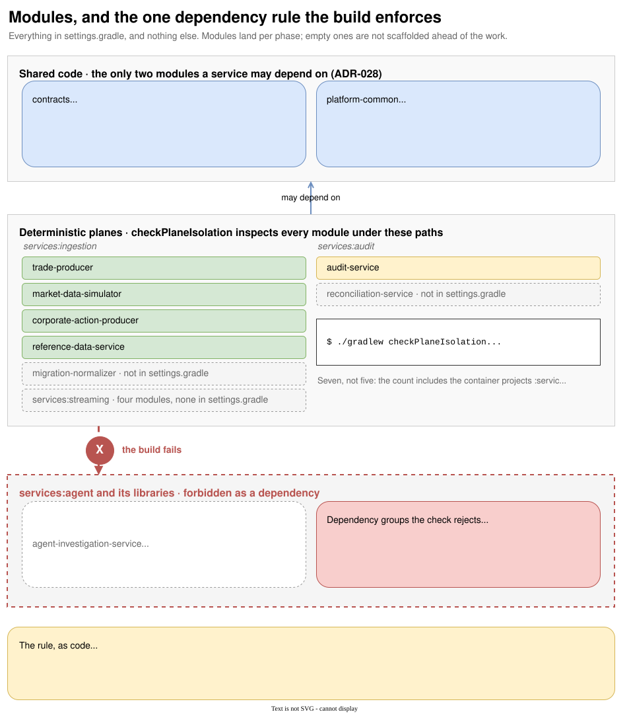

# Modules and the isolation rule

{ .diagram }
Click to zoom. Source: `guide/docs/diagrams/modules.drawio`.
{: .diagram-hint }

## What is in the build

`settings.gradle` is the complete list. Seven entries, and the comment block above them names the
services that will land later without including them.

```groovy
include 'contracts'
include 'platform-common'

include 'services:ingestion:trade-producer'
include 'services:ingestion:market-data-simulator'
include 'services:ingestion:corporate-action-producer'
include 'services:ingestion:reference-data-service'
include 'services:audit:audit-service'
include 'services:streaming:market-data-cache-projector'
```

Modules land when the work reaches them. Creating an empty module ahead of its phase produces a
directory that looks like a component, appears in the plane isolation count, and implements nothing,
so the convention is not to.

The root project is an aggregator and holds no source. Deployable units are the service modules, and
each owns its own image, workload identity, consumer group, scaling policy and database schema
(ADR-028). The package root is `dev.engnotes.fes.{service}`.

## The two shared modules

`contracts` holds the Avro schema files and the types generated from them. No Spring wiring, no
service code, no business logic. It also owns the `updateSchemaBaseline` task, which is how a
deliberate breaking change gets accepted.

`platform-common` holds the cross-cutting Kafka conventions:

| Type | What it does |
| --- | --- |
| `ProducerDurabilityConfiguration` | Forces `acks=all`, idempotence, lz4, 64KB batches on every producer factory |
| `ConsumerAcknowledgementConfiguration` | Forces `enable.auto.commit=false` and `MANUAL_IMMEDIATE` on every consumer |
| `DeadLetterPublisher` | Builds a `DeadLetterEvent` and sends it to `{topic}.dlq` |
| `FailureTracker` | Remembers first failure time and attempt count so the DLQ event carries real numbers |

Its test fixtures are shared too, consumed with
`testImplementation testFixtures(project(':platform-common'))`:

| Fixture | What it does |
| --- | --- |
| `KafkaAvroStack` | A real broker plus a real Schema Registry, started once per JVM |
| `SecureKafkaStack` | An authenticated broker with SASL/PLAIN and the `StandardAuthorizer` |
| `KafkaAclPolicy` | Parses a service's committed `kafka-acls.yml` |
| `KafkaAclScriptRenderer` | Renders those policies into arguments for the local stack |
| `KafkaProducerAuthorizationContract` | The one ALLOW, two DENY contract every write-only identity satisfies |
| `TestcontainersConfiguration` | Shared container wiring |

Neither shared module may hold business logic. If a change wants to add domain logic to either, it
belongs in a service.

## The rule the build enforces

`build.gradle` declares the rule as data:

```groovy
ext.deterministicPlanePrefixes = [':services:ingestion', ':services:streaming', ':services:audit']
ext.agentOnlyDependencyMarkers = ['org.neo4j', 'com.anthropic', 'dev.langchain4j', 'io.github.ollama4j']
```

A module whose path starts with one of the three prefixes fails the build if it declares a
`ProjectDependency` on a path starting with `:services:agent`, or any dependency whose group starts
with one of the four markers.

Two implementation details are worth copying if you write a similar check.

**Violations are collected at configuration time into plain serializable data.** The task body never
touches `Project`, which is what keeps the task compatible with the Gradle configuration cache.

**The task prints how many modules it inspected.**

```console
$ ./gradlew checkPlaneIsolation
Plane isolation: 9 deterministic-plane module(s) checked
```

Without that line, a check that inspects nothing looks exactly like a check that found nothing. The
count runs ahead of the number of services because it includes the intermediate container projects
`:services:ingestion`, `:services:audit` and `:services:streaming`. Adding the first module under a
new group moves the count by two, the group and the leaf, which is why it went from seven to nine
when `market-data-cache-projector` landed.

## Layering inside a service

The rules in `.claude/rules/architecture.md` are short and mechanical:

- **Consumer**: deserialise, delegate to a service, manage acknowledgement and the DLQ path. No
  business logic. `AuditRecordConsumer` is two statements long for this reason.
- **Service**: business logic only. No HTTP concerns, no persistence concerns.
- **Controller**: validate input, map to and from DTOs, delegate. No business logic.
- **Repository**: persistence only.
- No `@Transactional` on controllers or consumers. Services own transaction boundaries.

Naming follows the same shape: `{Domain}Service`, `{Entity}Repository`, `{Thing}Event` in
`dev.engnotes.fes.events`, and a consumer group name that equals the service name with no suffix.

## No shared database schemas

Cross-service reads go through Kafka or a versioned HTTP contract. No service reads another's tables.
This is not yet exercised, because no delivered service has a datastore: the reference data service in
particular has none by design, since the compacted `reference-data.instruments` topic is the
reconstruction source.
