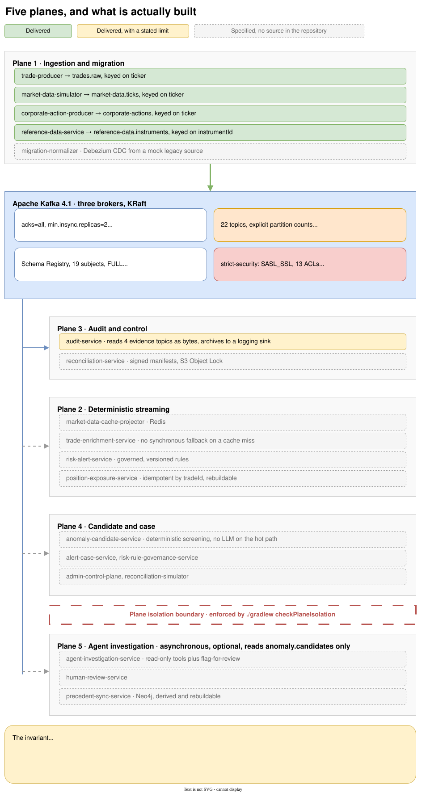
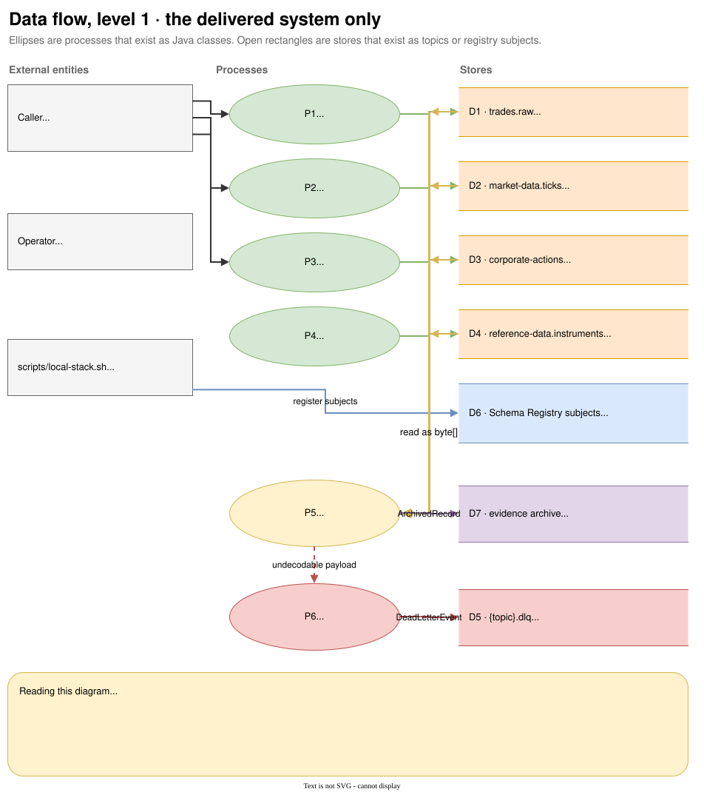

# Five planes

The plane model is the single idea that makes the repository layout, the module names, the build rules
and the service objectives follow from one another. It is worth ten minutes even if you only ever
touch one service.

{ .diagram }
Click to zoom. Source: `guide/docs/diagrams/five-planes.drawio`.
{: .diagram-hint }

## The five

**Plane 1, ingestion and migration.** Synthetic producers, plus Debezium change capture from a mock
legacy PostgreSQL source. Four producers are built. The migration normalizer is not.

**Plane 2, deterministic streaming.** Enrichment, risk evaluation, position and exposure read models.
This is where the 50,000 events/sec and sub-200ms figures live, and they are targets rather than
measurements. One of the four services is built, [the market cache projector](projector.md).
Enrichment, risk alerting and the position read model are not.

**Plane 3, audit and control.** An immutable evidence archive with signed manifests, and a
reconciliation control that proves the archive covers the stream. The archival consumer is built; the
durable sink and the reconciliation control are not.

**Plane 4, candidate and case.** Deterministic anomaly screening promotes a bounded subset of events
to `anomaly.candidates`, and alert cases and maker-checker rule governance are handled here. Nothing
is built.

**Plane 5, agent investigation.** A capability-bounded LLM agent gathers evidence through read-only
tools, a Neo4j precedent graph supplies similar cases, and a human reviews the result. Nothing is
built.

## The invariant

Plane 5 is asynchronous and optional. A provider outage, throttling, graph unavailability or budget
exhaustion must never block Planes 1 to 3, and must never add an availability dependency to them.

This is not a preference about coupling. It is the reason the architecture can state a throughput
target at all. The deterministic plane carries a 50,000 events/sec target with a sub-200ms p99
end-to-end budget, sub-10ms p99 enrichment and sub-5ms p99 risk evaluation. The agent plane is
measured separately, in candidates per second and time to case. Attributing a deterministic-plane
number to the agent plane, or the reverse, is the mistake the separation exists to prevent.

Two consequences follow directly, and both are already visible in the delivered code and the ADRs.

**Deterministic screening comes first.** A bounded subset of events is promoted to
`anomaly.candidates`, and an LLM is never called per event on the hot path (ADR-021). The agent plane
consumes `anomaly.candidates` and never `trades.enriched` directly.

**The agent proposes, it does not act.** Its tools are read-only, plus `flag-for-review`, which can
create a proposal only. The model holds no credential for ledger mutation, risk-rule approval, DLQ
replay, IAM administration, audit retention changes or remediation execution. Safety here is an
authorization property enforced outside the model, never a prompt instruction asking the model to
behave (ADR-023).

## How the invariant is enforced today

The build enforces the structural half. `./gradlew checkPlaneIsolation` fails if any module under
`services/ingestion`, `services/streaming` or `services/audit` takes a dependency on a
`:services:agent` project, or on a library whose group starts with `org.neo4j`, `com.anthropic`,
`dev.langchain4j` or `io.github.ollama4j`.

The runtime half cannot be enforced yet, because there is no agent plane to isolate from. When it
lands, the isolation will need a runtime demonstration too: a provider outage that leaves the
deterministic path unaffected. That is Phase 8 work, and the guide will not claim it before then.

See [Modules and the isolation rule](modules.md) for how the check is implemented and why it prints
the number of modules it inspected.

## The same system, as data flow

The plane diagram above shows intent. This one shows only what moves data today: four processes
writing four topics, one process reading them, one quarantine path, and a registry every one of them
depends on.

{ .diagram }
Click to zoom. Source: `guide/docs/diagrams/dfd-level-1.drawio`.
{: .diagram-hint }

Two things are worth noticing. There is exactly one consumer, so every other arrow into a store is a
write, and the producers' Kafka policies deny reading back what they wrote. And the evidence archive
is the one store whose writer is real and whose destination is not.

## Reading the delivery state honestly

Plane 1 has four working producers and one absent one. Plane 3 has a consumer whose sink logs and
discards. Planes 2, 4 and 5 have specifications and no source.

The uneven shape is deliberate rather than accidental. The sequencing puts the event spine first, then
a security slice ahead of streaming, on the argument that authorization proven late is authorization
retrofitted. What that costs is visible in this guide. There is an
authorization story worth reading and no enrichment story at all.

For the full list of what each unbuilt plane is specified to do, see
[Specified, not built](not-built.md).
