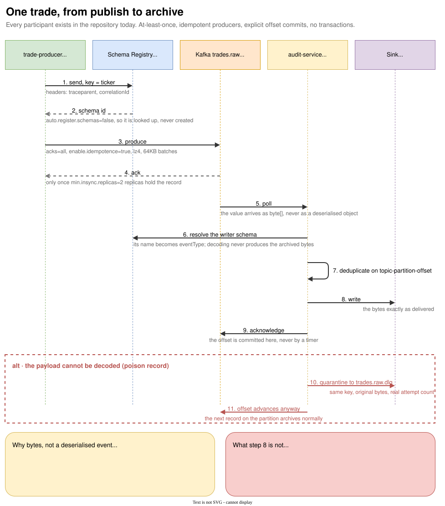

# Follow one trade

One `TradeEvent`, from a publisher call to an archived record. Read this page once, slowly. It touches
almost every delivered module, and the rest of the guide is a set of footnotes to it.

{ .diagram }
Click to zoom. Source: `guide/docs/diagrams/trade-to-archive.drawio`.
{: .diagram-hint }

## Hop 0: the contract exists before the code does

`contracts/src/main/avro/TradeEvent.avsc` defines the payload. The Avro plugin generates
`dev.engnotes.fes.events.TradeEvent` at build time, so no hand-written class can drift from the schema.

The record carries the trade itself (`tradeId`, `ticker`, `quantity`, `price`, `side`, `traderId`,
`accountId`), two timestamps (`eventTimestamp` and `producedAt`), a `correlationId`, a `traceContext`
map, and four nullable CDC provenance fields (`sourceSystem`, `sourceRecordKey`,
`sourceChangePosition`, `migrationBatchId`).

Those last four are worth pausing on. They exist so that a trade replayed out of the legacy system by
the future migration normalizer carries where it came from, in the same schema as a live trade. A
natively produced trade leaves all four null, and `TradeEventPublisherIntegrationTest` asserts exactly
that in `should_leave_cdc_provenance_null_for_a_natively_produced_trade`.

`traderId` and `accountId` are marked RESTRICTED in the schema `doc` fields. They must not appear in
high-cardinality logs or unmasked in responses to unauthorised roles.

## Hop 1: the publisher, and the two things it does deliberately

`TradeEventPublisher` in `services/ingestion/trade-producer` builds one `ProducerRecord` and sends it.
Two lines in it are contractual rather than incidental.

**The key is the ticker, not the trade id.**

```java
ProducerRecord<String, TradeEvent> record =
        new ProducerRecord<>(topic, trade.getTicker().toString(), trade);
```

Downstream risk evaluation keeps a running position per trader per ticker, and it relies on every
trade for a ticker landing on one partition so one consumer instance owns that state without
cross-instance coordination. Keying on `tradeId` would spread a ticker across all twelve partitions
and break that assumption silently: nothing would fail, the totals would just be wrong. The test that
locks it down is `should_key_the_record_on_ticker_so_a_tickers_trades_stay_on_one_partition`.

**Trace context goes on the headers, not only in the payload.**

The payload carries a `traceContext` map for consumers that rebuild a span from the event itself. But
end-to-end tracing has to work across services that never deserialise the body, so the publisher
copies `traceparent` and `tracestate` onto the record headers and always writes `correlationId`.
`should_omit_trace_headers_when_the_event_carries_no_trace_context` proves it does not invent headers
it does not have.

A send failure surfaces to the caller. It is a delivery failure, not a poison record: there is no
consumer offset to advance and no dead-letter semantics on the produce side, so the publisher logs it
and completes the future exceptionally rather than swallowing it into a fire-and-forget send.

## Hop 2: durability the service cannot weaken

The publisher never configures `acks`, retries, batching or compression. It cannot: those live in
`ProducerDurabilityConfiguration` in `platform-common`, applied through a
`DefaultKafkaProducerFactoryCustomizer` to every producer factory in the platform.

```java
static final Map<String, Object> DURABILITY_PROFILE = Map.of(
        ProducerConfig.ACKS_CONFIG, "all",
        ProducerConfig.ENABLE_IDEMPOTENCE_CONFIG, true,
        ProducerConfig.MAX_IN_FLIGHT_REQUESTS_PER_CONNECTION, 5,
        ProducerConfig.RETRIES_CONFIG, Integer.MAX_VALUE,
        ProducerConfig.DELIVERY_TIMEOUT_MS_CONFIG, 120_000,
        ProducerConfig.REQUEST_TIMEOUT_MS_CONFIG, 30_000,
        ProducerConfig.BATCH_SIZE_CONFIG, 65_536,
        ProducerConfig.LINGER_MS_CONFIG, 5,
        ProducerConfig.COMPRESSION_TYPE_CONFIG, "lz4",
        ProducerConfig.BUFFER_MEMORY_CONFIG, 67_108_864L);
```

Applying this programmatically rather than in each service's YAML is the point. A service that forgets
to set `acks` still gets `acks=all`. A service that wants weaker durability has to say so in code,
where a reviewer sees it.

Note what is absent: any transactional configuration. Delivery is at-least-once with idempotent
producers and deduplication by deterministic key, and the platform is never described as
exactly-once (ADR-019).

## Hop 3: the registry, before the broker

The value serializer is `KafkaAvroSerializer`, and the trade producer runs with
`auto.register.schemas: false` (`application.yml`). The producer therefore looks the schema up rather
than creating it. A subject that was never provisioned fails at the first record.

That is deliberate. A deploy must not be able to introduce a schema version that routed around the
compatibility gate (ADR-029), which makes registration a provisioning step rather than a side effect
of running. The step lives in `deploy/compose/subjects.tsv` and `scripts/local-stack.sh`.

See [Event contracts](contracts.md) for the whole pipeline, including why the compatibility level is
FULL and not BACKWARD.

## Hop 4: three brokers, and what the ack means

`acks=all` on its own guarantees nothing. It means "wait for the in-sync replicas", and on a
single-broker cluster the set of in-sync replicas is one.

The local stack therefore runs three brokers with `KAFKA_DEFAULT_REPLICATION_FACTOR: 3` and
`KAFKA_MIN_INSYNC_REPLICAS: 2` (`deploy/compose/docker-compose.yml`). The ack that comes back to the
producer means two replicas hold the record, which is the property that makes broker loss survivable.

`trades.raw` has 12 partitions and 7-day retention (`deploy/compose/topics.tsv`). Twelve is the
scaling ceiling for trade-path consumer groups.

## Hop 5: the consumer reads bytes

`AuditRecordConsumer` is the whole listener:

```java
@KafkaListener(topics = "#{'${fes.audit-service.topics}'.split(',')}")
public void archive(ConsumerRecord<String, byte[]> record, Acknowledgment acknowledgment) {
    archiveService.archive(record);
    acknowledgment.acknowledge();
}
```

`byte[]`, not `TradeEvent`. This is the most important decision on the read side, and it is worth two
separate reasons.

The first is about evidence. The archive's product is the payload that was published. Decode on the
way in and re-encode on the way out, and what gets stored is a re-encoding: an integrity check would
then verify the re-encoding rather than the evidence.

The second is about blast radius. A schema failure inside the listener is one quarantined record. The
same failure inside the deserialiser happens before the listener is called, and it stalls the
partition.

The offset is committed at `acknowledgment.acknowledge()`, after the sink accepted the record, never
by an auto-commit timer. `ConsumerAcknowledgementConfiguration` in `platform-common` forces
`enable.auto.commit=false` and `AckMode.MANUAL_IMMEDIATE` on every consumer in the platform, for the
same reason the producer profile is forced: a service cannot ship weaker offset management by
omission.

`isolation.level` is deliberately unset. No producer uses the transactional API, and
`read_committed` would advertise a write path that does not exist.

## Hop 6: classify, deduplicate, archive, in that order

`AuditArchiveService.archive` does four things.

It builds an `ArchivedRecord` from the broker coordinates plus the payload. It asks
`AuditEventDecoder` for the event type, which resolves the writer schema from the registry into a
generic container and takes the schema name. The decoder uses `SPECIFIC_AVRO_READER_CONFIG=false` on
purpose: the audit service archives every evidence topic, and a specific reader would make it a module
that depends on every schema in the platform and needs a redeploy each time one is added.

Then it checks the idempotency key:

```java
public String idempotencyKey() {
    return topic + "-" + partition + "-" + offset;
}
```

Topic, partition and offset. Delivery is at-least-once, so a rebalance or a restart before the offset
commit replays records that were already archived. Broker coordinates make the duplicate recognisable
without the archive having to understand any event's payload.

Finally it writes to the sink, and only then marks the key seen:

```java
sink.write(archived);
recentlyArchived.add(archived.idempotencyKey());
```

Reverse those two lines and a failed write looks like a completed one to the retry that follows. The
record would be dropped rather than quarantined: a silent hole in the evidence trail with nothing
failing anywhere. `should_archive_on_retry_when_the_sink_rejected_the_first_attempt` is the test that
holds the ordering in place.

!!! note "What the deduplication window actually covers"

    The window is an access-ordered `LinkedHashMap` bounded at `recent-record-window: 100000`. It
    suppresses the duplicate that at-least-once actually produces, redelivery of uncommitted offsets
    inside a running consumer. It does not survive a restart, and it does not catch a replay older
    than the window. Restart-safe deduplication belongs to the durable sink, whose object key carries
    the offset range, and that sink is Phase 3. Nothing here is end-to-end exactly-once.

## Hop 7: the sink, and the honest gap

`LoggingAuditSink` logs the record and discards it.

S3 Parquet, the sidecar manifest, the KMS signature and Object Lock retention are Phase 3 work. Until
they land, no FR-05 or FR-16 evidence claim rests on this path, and the guide does not make one. The
interface, the writer, the classification and the deduplication are real; the durable destination is
not.

## The other path: one poison record

A payload that cannot be decoded against the registry raises `AuditDecodeException` from the decoder.
What happens next is configured in `AuditKafkaConfiguration`.

Retry is bounded at three attempts total, with exponential backoff from 100ms to a 5s cap and a 5s
maximum elapsed time. `AuditDecodeException` is registered as not retryable, because the bytes do not
improve, so a decode failure goes straight to the recoverer while a transient sink error still gets
its three attempts.

The recoverer calls `DeadLetterPublisher`, which is shared code in `platform-common`. It sends a
`DeadLetterEvent` to `record.topic() + ".dlq"`. The name is derived, never configured per service, so
a service cannot ship a name that no replay tool looks at. The suffix is lowercase `.dlq`, not Spring
Kafka's default `.DLT`.

The quarantined record keeps its original key, so it and the records behind it for the same key stay
on one partition and a replay preserves their order. The event carries the delivered bytes, the whole
cause chain, the root cause class and message, a 500-character stack trace summary, the attempts
actually made, both failure timestamps, and the consumer group and instance.

Two details make the difference between a quarantine and a data loss:

`errorHandler.setAckAfterHandle(true)` commits the recovered record's offset, so one poison payload
does not block the partition behind it.

The recoverer joins on the send. A quarantine that failed silently while the offset advanced is the
one outcome an evidence archive cannot have, so a failed send propagates and the container stops
rather than skipping a record that was archived nowhere.

Quarantine is per record (ADR-027). There is no event-type-wide circuit breaker here and there must
not be one: a breaker that opens on a malformed payload stops archiving every healthy record behind
it, which is the failure the quarantine exists to avoid.

`should_quarantine_a_poison_record_and_keep_archiving_the_records_behind_it` runs this against a real
broker and a real registry.

## Reproduce it

The whole path is exercised by two integration tests. `TradeEventPublisherIntegrationTest` covers hops
1 to 4; `AuditRecordConsumerIntegrationTest` covers hops 5 to 7 and the poison path.

```bash
./gradlew :services:ingestion:trade-producer:integrationTest
./gradlew :services:audit:audit-service:integrationTest
```

Both are `*IntegrationTest` classes, which belong to the `integrationTest` task rather than to `test`.

Both need a running Docker daemon. They share `KafkaAvroStack` from `platform-common` test fixtures,
which starts one real broker and one real Schema Registry per JVM and never stops them: Ryuk reaps
the containers when the run ends, and reusing them across test classes costs seconds rather than tens
of seconds.

## What you now know

You have seen the shape of every delivered component: a producer that keys deliberately and cannot
weaken its own durability, a registry that is provisioned rather than written to at runtime, a
three-broker cluster that makes `acks=all` mean something, a consumer that reads bytes and commits
explicitly, an idempotency key made of broker coordinates, and a per-record quarantine path.

Everything else in this guide either explains one of those in more depth or describes the rules that
keep them from drifting.
